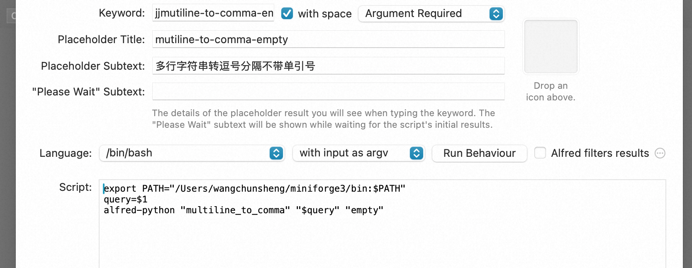

## Overview

A simple Python Alfred workflow tools template

### Installation

#### step1 
```
pip install -e .

alfred-python multiline_to_comma "line1
line2
line3"

```
#### step2

drop alfred tools.alfredworkflow to alfred work flow

#### step3

change script export path


### Debug

```
python -m alfred.main multiline_to_comma "line1
line2
line3"

python -m alfred.main query_adcode 北京市

python -m alfred.main df '2025 01 01'

```

### script filter config

```
export PATH="/Users/wangchunsheng/miniforge3/bin:$PATH"
query=$1
alfred-python "multiline_to_comma" "$query" "empty"
```



### 示例：


